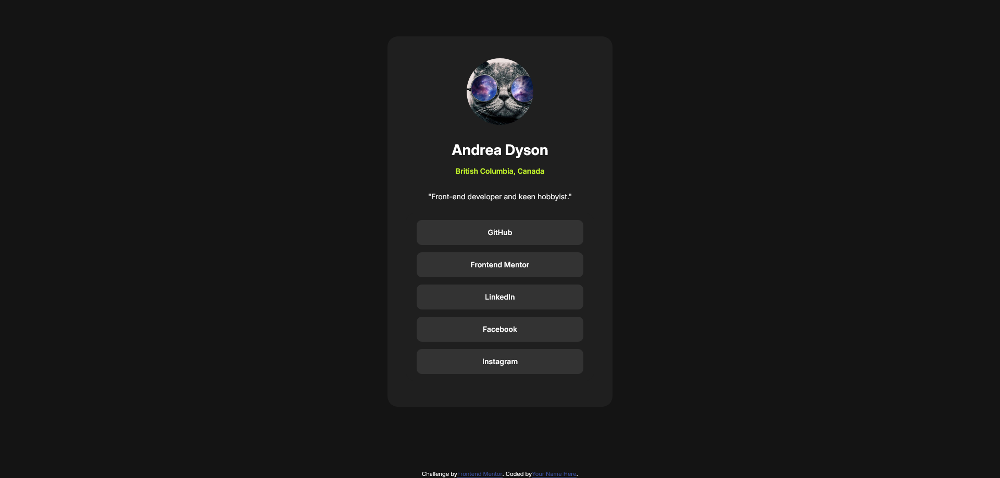

# Frontend Mentor - Social links profile solution

This is a solution to the [Social links profile challenge on Frontend Mentor](https://www.frontendmentor.io/challenges/social-links-profile-UG32l9m6dQ). Frontend Mentor challenges help you improve your coding skills by building realistic projects. 

## Table of contents

- [Overview](#overview)
  - [The challenge](#the-challenge)
  - [Screenshot](#screenshot)
  - [Links](#links)
- [My process](#my-process)
  - [Built with](#built-with)
  - [What I learned](#what-i-learned)
  - [Continued development](#continued-development)
  - [Useful resources](#useful-resources)
  - [AI Collaboration](#ai-collaboration)
- [Author](#author)

## Overview

### The challenge

Users should be able to:

- See hover and focus states for all interactive elements on the page

### Screenshot

### Links

- Solution URL: [GitHub](https://github.com/Momzilla007/social-links-profile.git)
- Live Site URL: [Netlify](https://social-links-profile-fem-challenge.netlify.app/)

## My process

Created a clean local Git repository on the main branch.
Connected the local repo to GitHub using the --set-upstream command.
Confirmed a .gitignore file was active to protect private configuration files.
Wrote base HTML structure using semantic tags like <main> and 
.
Placed font links before CSS files in the <head> to prevent page flickering.
Extracted inline styles out of the HTML into an external stylesheet.
Applied a baseline CSS reset to force consistent styles across all browsers.
Refactored HTML class names to make them highly precise.
Designed custom, reusable styles for interactive button elements.
Saved a new graphic asset into the project's assets folder.
Fixed a squished layout by making the image perfectly circular and fluid.
Added anchor tags to the html to prepare for each social media link to be included. 
Updated the git one final time before stopping for the night.
Add in the links for the anchor tags. Then added in the target for the links to open in a blank page. 
Fixed up the css style properties for the body, wrapper and main so the card was placed correctly. 
Finished up the challenge and updated the README doc.
Ran an html validation on my index.html and realized I needed to remove the button element from my social media links. Did this fix and then updated the git with the changes. 
Finalizing the README.md and then going to submit to FEM next.

### Built with

- Semantic HTML5 markup
- CSS custom properties
- Flexbox

### What I learned

One very important thing I learned in this lesson is that you cannot place an anchor tag within a button or vice versa. I may have known this before but had forgotten and thankfully, I ran my index.html through the markup validator to look for errors and it came up. I will always remember to validate from now on. Even checked the css too. So, I learned that validating is, in fact, helpful.  

Also, I learned that it is so much more fun when you personalize the content in these challenges. I like that this is about me and it may come in handy. 

Flexbox is actually pretty amazing.... I like it! 

Oh, and I also understand the :focus state a bit better now. 

### Continued development

I'd like to understand flex better, so I will be focusing on that a little more and improving my knowledge of css and learning what some of the new and recent features are and what ones are actually stable enough to safely use. I know I have seen some amazing things with transitions and what not and some stuff we used to use javascript for, can actually be created with css alone. Kind of crazy to me and that is awesome! I must learn this stuff. It looks pretty neat. 

### Useful resources

- [html validator](https://validator.w3.org/#validate_by_uri+with_options) - I was once taught that validating your html is best practice and I figure I should get back into that habit. If you ever want to validate your html and check for errors, this is a great tool.
- [css validator](https://jigsaw.w3.org/css-validator/) - Checked my css for any mistakes I may have made, and no errors found. Great tool for finding syntax errors.
- [freecodecamp forum question on anchors and buttons](https://forum.freecodecamp.org/t/solved-my-anchor-moves-my-botton-lol/160750) - A bit of info on using anchor tags with buttons and how you should not use them together, which is something I think I knew once upon a time but had forgotten. Anyway, this prompted me to make a fix and remove the button from my social media links. 

### AI Collaboration

Google AI helped with the git commits and helped me understand better what a good commit is and how to actually do them! I was struggling before but now I think I am getting the hang of it...or at least I'm improving somewhat.

I tried out VSCode autofill on this project just to see how good it is and well, I think I'm on the fence with this. Ultimately, I turned it back off again because it really doesn't seem to get the full picture. For example, I didn't want to add in margins that much because that messes with your layout, yet it kept putting in margins all the time.  

## Author

- Website - [Andrea Dyson](https://itsocodedesign.ca/)
- Frontend Mentor - [@Momzilla007](https://www.frontendmentor.io/profile/Momzilla007)
- LinkedIn - [@Andrea Dyson](https://www.linkedin.com/in/andrea-dyson-33994056/)

